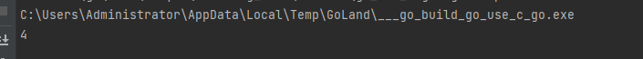

## 有关GCC环境配置的问题


出现如上图问题 可能是window系统安装了linux gcc

-> uninstall ->install windows gcc MinGW   

https://blog.csdn.net/QuantumYou/article/details/119676283?ops_request_misc=&request_id=&biz_id=102&utm_term=windows%20gcc%E4%B8%8B%E8%BD%BD%E5%AE%89%E8%A3%85&utm_medium=distribute.pc_search_result.none-task-blog-2~all~sobaiduweb~default-0-119676283.142^v63^js_top,201^v3^control_1,213^v2^t3_control2&spm=1018.2226.3001.4187

##  CGO 编程

### 快速入门

##### easy demo

```go
//hello.go
package main

import "C"

func main() {
	println("hello world!")
	println("it's my first day in HuiYan")
}

```

代码通过`import "C"`语句启用CGO特性，主函数只是通过Go内置的println函数输出字符串，其中并没有任何和CGO相关的代码。虽然没有调用CGO的相关函数，但是`go build`命令会在编译和链接阶段启动gcc编译器，这已经是一个完整的CGO程序了。

##### string demo 

```go
//string_demo.go
package main

//you can not put /n between

//#include <stdio.h>
import "C"

func main() {
	C.puts(C.CString("this is a string from C, demo show!\n"))
}
```

同时包含C语言的`<stdio.h>`头文件。然后通过CGO包的`C.CString`函数将Go语言字符串转为C语言字符串，最后调用CGO包的`C.puts`函数向标准输出窗口打印转换后的C字符串。没有释放使用`C.CString`创建的C语言字符串会导致内存泄漏。但是对于这个小程序来说，这样是没有问题的，因为程序退出后操作系统会自动回收程序的所有资源。

##### self_C demo

```go
//self_C.go
package main

/*
#include <stdio.h>

static void SayHello(const char* s){
	puts(s);
}
*/
import "C"

func main() {
	C.SayHello(C.CString("this is a C_self demo!\n"))
}

```

同样的，可以将SayHello放在一个以.c后缀的文件中，因为在独立编写的C文件中，为了允许外部使用，需要去掉函数的 static 修饰符

```c
#include <stdio.h>

void SayHello(const char *s){
    puts(s);
}
```

然后在CGO部分声明SayHello函数

```go
package main

//void SayHello(const char* s);
import "C"

func main() {
	C.SayHello(C.CString("another self_C demo\n"))
}

```

注意，如果之前运行的命令是`go run hello.go`或`go build hello.go`的话，此处须使用`go run "your/package"`或`go build "your/package"`才可以。若本就在包路径下的话，也可以直接运行`go run .`或`go build`。

得到结果


##### module_C demo

定义demo.h的头文件

```
//demo.h
void SayHello(const char* s);
```


实现满足头文件中函数的声明规范，实现对应的module_C.c

```go
#include "demo.h"
#include <stdio.h>

void SayHello(const char* s) {
    puts(s);
}
```

接口文件demo.h是hello模块的实现者和使用者共同的约定，但是该约定并没有要求必须使用C语言来实现SayHello函数。我们也可以用C++语言来重新实现这个C语言函数：

```go
module_C.cpp
#include <iostream>

extern "C" {
    #include "hello.h"
}

void SayHello(const char* s) {
    std::cout << s;
}
```

在C++版本的SayHello函数实现中，我们通过C++特有的`std::cout`输出流输出字符串。不过为了保证C++语言实现的SayHello函数满足C语言头文件demo.h定义的函数规范，我们需要通过`extern "C"`语句指示该函数的链接符号遵循C语言的规则。


##### go_make_c

先定义相关的接口在 demo.h 的接口文档中

**是否定义const 和需求有关 此处结果为不会被修改覆盖**

````c
//demo.h
void SayHello (/*const*/ char *s);
````

创建一个demo.go

```go
//demo.go
package main

import "C"

import "fmt"

//export SayHello
func SayHello(s *C.char) {
	fmt.Print(C.GoString(s))
}

```

通过CGO的`//export SayHello`指令将Go语言实现的函数`SayHello`导出为C语言函数。为了适配CGO导出的C语言函数，禁止了在函数的声明语句中的const修饰符。cgo生成的C语言版本SayHello函数最终会通过桥接代码调用Go语言版本的SayHello函数。

通过这样的接口技术，现在将SayHello当作一个标准库进行使用（和puts函数的使用方法类似）

```
//main.go
package main

//#include<demo.h>
import "C"

func main() {
	C.SayHello(C.CString("this is go make c function demo\n"))
}

```

最后获得运行结果


### CGO基础

##### import “C”

```go
package main

/*
#include <stdio.h>

void printint(int v){
printf("printint: %d\n",v);
}
*/
import "C"

func main() {
	v := 234
	C.printint(C.int(v))
}
```


Go是强类型语言，所以cgo中传递的参数类型必须与声明的类型完全一致，而且传递前必须用”C”中的转化函数转换成对应的C类型，不能直接传入Go中类型的变量。同时通过虚拟的C包导入的C语言符号并不需要是大写字母开头，它们不受Go语言的导出规则约束。

cgo将当前包引用的C语言符号都放到了虚拟的C包中，同时当前包依赖的其它Go语言包内部可能也通过cgo引入了相似的虚拟C包，但是不同的Go语言包引入的虚拟的C包之间的类型是不能通用的。这个约束对于要自己构造一些cgo辅助函数时有可能会造成一点的影响。

比如希望在Go中定义一个C语言字符指针对应的CChar类型，然后增加一个GoString方法返回Go语言字符串：

```go
package cgo_helper

//#include <stdio.h>
import "C"

type CChar C.char

func (p *CChar) GoString() string {
    return C.GoString((*C.char)(p))
}

func PrintCString(cs *C.char) {
    C.puts(cs)
}
```

现在我们可能会想在其它的Go语言包中也使用这个辅助函数：

```go
package main

//static const char* cs = "hello";
import "C"
import "./cgo_helper"

func main() {
    cgo_helper.PrintCString(C.cs)
}
```

这段代码是不能正常工作的，因为当前main包引入的`C.cs`变量的类型是当前`main`包的cgo构造的虚拟的C包下的`*char`类型（具体点是`*C.char`，更具体点是`*main.C.char`），它和cgo_helper包引入的`*C.char`类型（具体点是`*cgo_helper.C.char`）是不同的。在Go语言中方法是依附于类型存在的，不同Go包中引入的虚拟的C包的类型却是不同的（`main.C`不等`cgo_helper.C`），这导致从它们延伸出来的Go类型也是不同的类型（`*main.C.char`不等`*cgo_helper.C.char`），这最终导致了前面代码不能正常工作。

##### #cgo语句

在`import "C"`语句前的注释中可以通过`#cgo`语句设置编译阶段和链接阶段的相关参数。编译阶段的参数主要用于定义相关宏和指定头文件检索路径。链接阶段的参数主要是指定库文件检索路径和要链接的库文件。

```c
// #cgo CFLAGS: -DPNG_DEBUG=1 -I./include
// #cgo LDFLAGS: -L/usr/local/lib -lpng
// #include <png.h>
import "C"
```

上面的代码中，CFLAGS部分，`-D`部分定义了宏PNG_DEBUG，值为1；`-I`定义了头文件包含的检索目录。LDFLAGS部分，`-L`指定了链接时库文件检索目录，`-l`指定了链接时需要链接png库。

因为C/C++遗留的问题，C头文件检索目录可以是相对目录，但是库文件检索目录则需要绝对路径。在库文件的检索目录中可以通过`${SRCDIR}`变量表示当前包目录的绝对路径：

```
// #cgo LDFLAGS: -L${SRCDIR}/libs -lfoo
```

上面的代码在链接时将被展开为：

```
// #cgo LDFLAGS: -L/go/src/foo/libs -lfoo
```

`#cgo`语句主要影响CFLAGS、CPPFLAGS、CXXFLAGS、FFLAGS和LDFLAGS几个编译器环境变量。LDFLAGS用于设置链接时的参数，除此之外的几个变量用于改变编译阶段的构建参数(CFLAGS用于针对C语言代码设置编译参数)。

其中在windows平台下，编译前会预定义X86宏为1；在非widnows平台下，在链接阶段会要求链接math数学库。这种用法对于在不同平台下只有少数编译选项差异的场景比较适用。

如果在不同的系统下cgo对应着不同的c代码，我们可以先使用`#cgo`指令定义不同的C语言的宏，然后通过宏来区分不同的代码：

```go
package main

/*
#cgo windows CFLAGS: -DCGO_OS_WINDOWS=1
#cgo darwin CFLAGS: -DCGO_OS_DARWIN=1
#cgo linux CFLAGS: -DCGO_OS_LINUX=1

#if defined(CGO_OS_WINDOWS)
    const char* os = "windows";
#elif defined(CGO_OS_DARWIN)
    static const char* os = "darwin";
#elif defined(CGO_OS_LINUX)
    static const char* os = "linux";
#else
#    error(unknown os)
#endif
*/
import "C"

func main() {
    print(C.GoString(C.os))
}
```

成功检测本系统为 windows 系统 


##### build tag 条件编译

build tag 是在Go或cgo环境下的C/C++文件开头的一种特殊的注释。条件编译类似于前面通过`#cgo`指令针对不同平台定义的宏，只有在对应平台的宏被定义之后才会构建对应的代码。但是通过`#cgo`指令定义宏有个限制，它只能是基于Go语言支持的windows、darwin和linux等已经支持的操作系统。如果我们希望定义一个DEBUG标志的宏，`#cgo`指令就无能为力了。而Go语言提供的build tag 条件编译特性则可以简单做到。

```go
// +build debug

package main

var buildMode = "debug"
```

可以用以下命令构建：

```
go build -tags="debug"
go build -tags="windows debug"
```

我们可以通过`-tags`命令行参数同时指定多个build标志，它们之间用空格分隔。

当有多个build tag时，我们将多个标志通过逻辑操作的规则来组合使用。比如以下的构建标志表示只有在”linux/386“或”darwin平台下非cgo环境“才进行构建。

```go
// +build linux,386 darwin,!cgo
```

其中`linux,386`中linux和386用逗号链接表示AND的意思；而`linux,386`和`darwin,!cgo`之间通过空白分割来表示OR的意思。


### 类型转换

##### 数值类型

Go语言中数值类型和C语言数据类型基本上是相似的，以下是它们的对应关系表2-1所示。

| C语言类型              | CGO类型     | Go语言类型 |
| ---------------------- | ----------- | ---------- |
| char                   | C.char      | byte       |
| singed char            | C.schar     | int8       |
| unsigned char          | C.uchar     | uint8      |
| short                  | C.short     | int16      |
| unsigned short         | C.ushort    | uint16     |
| int                    | C.int       | int32      |
| unsigned int           | C.uint      | uint32     |
| long                   | C.long      | int32      |
| unsigned long          | C.ulong     | uint32     |
| long long int          | C.longlong  | int64      |
| unsigned long long int | C.ulonglong | uint64     |
| float                  | C.float     | float32    |
| double                 | C.double    | float64    |
| size_t                 | C.size_t    | uint       |

*表 2-1 Go语言和C语言类型对比*

需要注意的是，虽然在C语言中`int`、`short`等类型没有明确定义内存大小，但是在CGO中它们的内存大小是确定的。在CGO中，C语言的`int`和`long`类型都是对应4个字节的内存大小，`size_t`类型可以当作Go语言`uint`无符号整数类型对待。

CGO中，虽然C语言的`int`固定为4字节的大小，但是Go语言自己的`int`和`uint`却在32位和64位系统下分别对应4个字节和8个字节大小。如果需要在C语言中访问Go语言的`int`类型，可以通过`GoInt`类型访问，`GoInt`类型在CGO工具生成的`_cgo_export.h`头文件中定义。其实在`_cgo_export.h`头文件中，每个基本的Go数值类型都定义了对应的C语言类型，它们一般都是以单词Go为前缀下面是64位环境下，`_cgo_export.h`头文件生成的Go数值类型的定义，其中`GoInt`和`GoUint`类型分别对应`GoInt64`和`GoUint64`：

```c
typedef signed char GoInt8;
typedef unsigned char GoUint8;
typedef short GoInt16;
typedef unsigned short GoUint16;
typedef int GoInt32;
typedef unsigned int GoUint32;
typedef long long GoInt64;
typedef unsigned long long GoUint64;
typedef GoInt64 GoInt;
typedef GoUint64 GoUint;
typedef float GoFloat32;
typedef double GoFloat64;
```

除了`GoInt`和`GoUint`之外，我们并不推荐直接访问`GoInt32`、`GoInt64`等类型。更好的做法是通过C语言的C99标准引入的`<stdint.h>`头文件。为了提高C语言的可移植性，在`<stdint.h>`文件中，不但每个数值类型都提供了明确内存大小，而且和Go语言的类型命名更加一致。Go语言类型`<stdint.h>`头文件类型对比如表2-2所示。

| C语言类型 | CGO类型    | Go语言类型 |
| --------- | ---------- | ---------- |
| int8_t    | C.int8_t   | int8       |
| uint8_t   | C.uint8_t  | uint8      |
| int16_t   | C.int16_t  | int16      |
| uint16_t  | C.uint16_t | uint16     |
| int32_t   | C.int32_t  | int32      |
| uint32_t  | C.uint32_t | uint32     |
| int64_t   | C.int64_t  | int64      |
| uint64_t  | C.uint64_t | uint64     |

*表 2-2 `<stdint.h>`类型对比*

前文说过，如果C语言的类型是由多个关键字组成，则无法通过虚拟的“C”包直接访问(比如C语言的`unsigned short`不能直接通过`C.unsigned short`访问)。但是，在`<stdint.h>`中通过使用C语言的`typedef`关键字将`unsigned short`重新定义为`uint16_t`这样一个单词的类型后，我们就可以通过`C.uint16_t`访问原来的`unsigned short`类型了。对于比较复杂的C语言类型，推荐使用`typedef`关键字提供一个规则的类型命名，这样更利于在CGO中访问。

##### go 字符串和切片

在CGO生成的`_cgo_export.h`头文件中还会为Go语言的字符串、切片、字典、接口和管道等特有的数据类型生成对应的C语言类型：

```c
typedef struct { const char *p; GoInt n; } GoString;
typedef void *GoMap;
typedef void *GoChan;
typedef struct { void *t; void *v; } GoInterface;
typedef struct { void *data; GoInt len; GoInt cap; } GoSlice;
```

不过需要注意的是，其中只有字符串和切片在CGO中有一定的使用价值，因为CGO为他们的某些GO语言版本的操作函数生成了C语言版本，因此二者可以在Go调用C语言函数时马上使用;而CGO并未针对其他的类型提供相关的辅助函数，且Go语言特有的内存模型导致我们无法保持这些由Go语言管理的内存指针，所以它们C语言环境并无使用的价值。

在导出的C语言函数中我们可以直接使用Go字符串和切片。假设有以下两个导出函数：

```go
//export helloString
func helloString(s string) {}

//export helloSlice
func helloSlice(s []byte) {}
```

CGO生成的`_cgo_export.h`头文件会包含以下的函数声明：

```c
extern void helloString(GoString p0);
extern void helloSlice(GoSlice p0);
```

不过需要注意的是，如果使用了GoString类型则会对`_cgo_export.h`头文件产生依赖，而这个头文件是动态输出的。

##### 结构体、联合、枚举类型

C语言的结构体、联合、枚举类型不能作为匿名成员被嵌入到Go语言的结构体中。在Go语言中，我们可以通过`C.struct_xxx`来访问C语言中定义的`struct xxx`结构体类型。结构体的内存布局按照C语言的通用对齐规则，在32位Go语言环境C语言结构体也按照32位对齐规则，在64位Go语言环境按照64位的对齐规则。对于指定了特殊对齐规则的结构体，无法在CGO中访问。


结构体的简单用法如下：

```go
package main

/*
struct A {
    int i;
    float f;
};
*/
import "C"
import "fmt"

func main() {
	var a C.struct_A
	a.i = 3
	a.f = 3.5
	fmt.Println(a.i)
	fmt.Println(a.f)
}

```


如果结构体的成员名字中碰巧是Go语言的关键字，可以通过在成员名开头添加下划线来访问：

```go
/*
struct A {
    int type; // type 是 Go 语言的关键字
};
*/
import "C"
import "fmt"

func main() {
    var a C.struct_A
    a._type=10
    fmt.Println(a._type) // _type 对应 type
}
```


但是如果有2个成员：一个是以Go语言关键字命名，另一个刚好是以下划线和Go语言关键字命名，那么以Go语言关键字命名的成员将无法访问（被屏蔽）：

```go
/*
struct A {
    int   type;  // type 是 Go 语言的关键字
    float _type; // 将屏蔽CGO对 type 成员的访问
};
*/
import "C"
import "fmt"

func main() {
    var a C.struct_A
    a._type = 3.5
    fmt.Println(a._type) // _type 对应 _type
}
```


C语言结构体中位字段对应的成员无法在Go语言中访问，如果需要操作位字段成员，需要通过在C语言中定义辅助函数来完成。对应零长数组的成员，无法在Go语言中直接访问数组的元素，但其中零长的数组成员所在位置的偏移量依然可以通过`unsafe.Offsetof(a.arr)`来访问。

```go
/*
struct A {
    int   size: 10; // 位字段无法访问
    float arr[];    // 零长的数组也无法访问
};
*/
import "C"
import "fmt"

func main() {
    var a C.struct_A
    fmt.Println(a.size) // 错误: 位字段无法访问
    fmt.Println(a.arr)  // 错误: 零长的数组也无法访问
}
```


在C语言中，我们无法直接访问Go语言定义的结构体类型。

对于联合类型，我们可以通过`C.union_xxx`来访问C语言中定义的`union xxx`类型。但是Go语言中并不支持C语言联合类型，它们会被转为对应大小的字节数组。

```go
/*
#include <stdint.h>

union B1 {
    int i;
    float f;
};

union B2 {
    int8_t i8;
    int64_t i64;
};
*/
import "C"
import "fmt"

func main() {
    var b1 C.union_B1;
    fmt.Printf("%T\n", b1) // [4]uint8

    var b2 C.union_B2;
    fmt.Printf("%T\n", b2) // [8]uint8
}
```


如果需要操作C语言的联合类型变量，一般有三种方法：第一种是在C语言中定义辅助函数；第二种是通过Go语言的"encoding/binary"手工解码成员(需要注意大端小端问题)；第三种是使用`unsafe`包强制转型为对应类型(这是性能最好的方式)。下面展示通过`unsafe`包访问联合类型成员的方式：

```go
/*
#include <stdint.h>

union B {
    int i;
    float f;
};
*/
import "C"
import "fmt"

func main() {
    var b C.union_B;
    fmt.Println("b.i:", *(*C.int)(unsafe.Pointer(&b)))
    fmt.Println("b.f:", *(*C.float)(unsafe.Pointer(&b)))
}
```


虽然`unsafe`包访问最简单、性能也最好，但是对于有嵌套联合类型的情况处理会导致问题复杂化。对于复杂的联合类型，推荐通过在C语言中定义辅助函数的方式处理。

对于枚举类型，我们可以通过`C.enum_xxx`来访问C语言中定义的`enum xxx`结构体类型。

```go
/*
enum C {
    ONE,
    TWO,
};
*/
import "C"
import "fmt"

func main() {
    var c C.enum_C = C.TWO
    fmt.Println(c)
    fmt.Println(C.ONE)
    fmt.Println(C.TWO)
}
```


在C语言中，枚举类型底层对应`int`类型，支持负数类型的值。我们可以通过`C.ONE`、`C.TWO`等直接访问定义的枚举值。

##### 数组、字符串和切片

https://juejin.cn/post/6844903921274585095

教学博客

在C语言中，数组名其实对应于一个指针，指向特定类型特定长度的一段内存，但是这个指针不能被修改；当把数组名传递给一个函数时，实际上传递的是数组第一个元素的地址。为了讨论方便，我们将一段特定长度的内存统称为数组。C语言的字符串是一个char类型的数组，字符串的长度需要根据表示结尾的NULL字符的位置确定。C语言中没有切片类型。

在Go语言中，数组是一种值类型，而且数组的长度是数组类型的一个部分。Go语言字符串对应一段长度确定的只读byte类型的内存。Go语言的切片则是一个简化版的动态数组。

Go语言和C语言的数组、字符串和切片之间的相互转换可以简化为Go语言的切片和C语言中指向一定长度内存的指针之间的转换。

CGO的C虚拟包提供了以下一组函数，用于Go语言和C语言之间数组和字符串的双向转换：

```go
// Go string to C string
// The C string is allocated in the C heap using malloc.
// It is the caller's responsibility to arrange for it to be
// freed, such as by calling C.free (be sure to include stdlib.h
// if C.free is needed).
func C.CString(string) *C.char

// Go []byte slice to C array
// The C array is allocated in the C heap using malloc.
// It is the caller's responsibility to arrange for it to be
// freed, such as by calling C.free (be sure to include stdlib.h
// if C.free is needed).
func C.CBytes([]byte) unsafe.Pointer

// C string to Go string
func C.GoString(*C.char) string

// C data with explicit length to Go string
func C.GoStringN(*C.char, C.int) string

// C data with explicit length to Go []byte
func C.GoBytes(unsafe.Pointer, C.int) []byte
```

其中`C.CString`针对输入的Go字符串，克隆一个C语言格式的字符串；返回的字符串由C语言的`malloc`函数分配，不使用时需要通过C语言的`free`函数释放。`C.CBytes`函数的功能和`C.CString`类似，用于从输入的Go语言字节切片克隆一个C语言版本的字节数组，同样返回的数组需要在合适的时候释放。`C.GoString`用于将从NULL结尾的C语言字符串克隆一个Go语言字符串。`C.GoStringN`是另一个字符数组克隆函数。`C.GoBytes`用于从C语言数组，克隆一个Go语言字节切片。

该组辅助函数都是以克隆的方式运行。当Go语言字符串和切片向C语言转换时，克隆的内存由C语言的`malloc`函数分配，最终可以通过`free`函数释放。当C语言字符串或数组向Go语言转换时，克隆的内存由Go语言分配管理。通过该组转换函数，转换前和转换后的内存依然在各自的语言环境中，它们并没有跨越Go语言和C语言。克隆方式实现转换的优点是接口和内存管理都很简单，缺点是克隆需要分配新的内存和复制操作都会导致额外的开销。

在`reflect`包中有字符串和切片的定义：

```go
type StringHeader struct {
    Data uintptr
    Len  int
}

type SliceHeader struct {
    Data uintptr
    Len  int
    Cap  int
}
```

如果不希望单独分配内存，可以在Go语言中直接访问C语言的内存空间：

```go
package main

/*
static char arr[10];
static char *s = "Hello";
*/
import "C"
import (
	"reflect"
	"unsafe"
)

func main() {
	// 通过 reflect.SliceHeader 转换
	var arr0 []byte
	var arr0Hdr = (*reflect.SliceHeader)(unsafe.Pointer(&arr0))
	arr0Hdr.Data = uintptr(unsafe.Pointer(&C.arr[0]))
	arr0Hdr.Len = 10
	arr0Hdr.Cap = 10

	// 通过切片语法转换
	arr1 := (*[31]byte)(unsafe.Pointer(&C.arr[0]))[:10:10]

	var s0 string
	var s0Hdr = (*reflect.StringHeader)(unsafe.Pointer(&s0))
	s0Hdr.Data = uintptr(unsafe.Pointer(C.s))
	s0Hdr.Len = int(C.strlen(C.s))

	sLen := int(C.strlen(C.s))
	s1 := string((*[31]byte)(unsafe.Pointer(&C.s[0]))[:sLen:sLen])

	println(arr1)
	println(s1)
}

```

感觉没有实现这个方法


因为Go语言的字符串是只读的，用户需要自己保证Go字符串在使用期间，底层对应的C字符串内容不会发生变化、内存不会被提前释放掉。

在CGO中，会为字符串和切片生成和上面结构对应的C语言版本的结构体：

```c
typedef struct { const char *p; GoInt n; } GoString;
typedef struct { void *data; GoInt len; GoInt cap; } GoSlice;
```

在C语言中可以通过`GoString`和`GoSlice`来访问Go语言的字符串和切片。如果是Go语言中数组类型，可以将数组转为切片后再行转换。如果字符串或切片对应的底层内存空间由Go语言的运行时管理，那么在C语言中不能长时间保存Go内存对象。

##### 指针之间的转换

在C语言中，不同类型的指针是可以显式或隐式转换的，如果是隐式只是会在编译时给出一些警告信息。但是Go语言对于不同类型的转换非常严格，任何C语言中可能出现的警告信息在Go语言中都可能是错误！指针是C语言的灵魂，指针间的自由转换也是cgo代码中经常要解决的第一个重要的问题。

在Go语言中两个指针的类型完全一致则不需要转换可以直接通用。如果一个指针类型是用type命令在另一个指针类型基础之上构建的，换言之两个指针底层是相同完全结构的指针，那么我我们可以通过直接强制转换语法进行指针间的转换。但是cgo经常要面对的是2个完全不同类型的指针间的转换，原则上这种操作在纯Go语言代码是严格禁止的。

cgo存在的一个目的就是打破Go语言的禁止，恢复C语言应有的指针的自由转换和指针运算。以下代码演示了如何将X类型的指针转化为Y类型的指针：

```go
var p *X
var q *Y

q = (*Y)(unsafe.Pointer(p)) // *X => *Y
p = (*X)(unsafe.Pointer(q)) // *Y => *X
```

为了实现X类型指针到Y类型指针的转换，我们需要借助`unsafe.Pointer`作为中间桥接类型实现不同类型指针之间的转换。`unsafe.Pointer`指针类型类似C语言中的`void*`类型的指针。

下面是指针间的转换流程的示意图：


*图 2-1 X类型指针转Y类型指针*

任何类型的指针都可以通过强制转换为`unsafe.Pointer`指针类型去掉原有的类型信息，然后再重新赋予新的指针类型而达到指针间的转换的目的。

##### 数值和指针的转换

不同类型指针间的转换看似复杂，但是在cgo中已经算是比较简单的了。在C语言中经常遇到用普通数值表示指针的场景，也就是说如何实现数值和指针的转换也是cgo需要面对的一个问题。

为了严格控制指针的使用，Go语言禁止将数值类型直接转为指针类型！不过，Go语言针对`unsafe.Pointr`指针类型特别定义了一个uintptr类型。我们可以uintptr为中介，实现数值类型到`unsafe.Pointr`指针类型到转换。再结合前面提到的方法，就可以实现数值和指针的转换了。

下面流程图演示了如何实现int32类型到C语言的`char*`字符串指针类型的相互转换：


*图 2-2 int32和`char*`指针转换*

转换分为几个阶段，在每个阶段实现一个小目标：首先是int32到uintptr类型，然后是uintptr到`unsafe.Pointr`指针类型，最后是`unsafe.Pointr`指针类型到`*C.char`类型。

##### 切片间的转换

在C语言中数组也一种指针，因此两个不同类型数组之间的转换和指针间转换基本类似。但是在Go语言中，数组或数组对应的切片都不再是指针类型，因此我们也就无法直接实现不同类型的切片之间的转换。

不过Go语言的reflect包提供了切片类型的底层结构，再结合前面讨论到不同类型之间的指针转换技术就可以实现`[]X`和`[]Y`类型的切片转换：

```go
var p []X
var q []Y

pHdr := (*reflect.SliceHeader)(unsafe.Pointer(&p))
qHdr := (*reflect.SliceHeader)(unsafe.Pointer(&q))

pHdr.Data = qHdr.Data
pHdr.Len = qHdr.Len * unsafe.Sizeof(q[0]) / unsafe.Sizeof(p[0])
pHdr.Cap = qHdr.Cap * unsafe.Sizeof(q[0]) / unsafe.Sizeof(p[0])
```

不同切片类型之间转换的思路是先构造一个空的目标切片，然后用原有的切片底层数据填充目标切片。如果X和Y类型的大小不同，需要重新设置Len和Cap属性。需要注意的是，如果X或Y是空类型，上述代码中可能导致除0错误，实际代码需要根据情况酌情处理。

下面演示了切片间的转换的具体流程：


*图 2-3 X类型切片转Y类型切片*

### 函数调用

##### go调用C函数

对于一个启用CGO特性的程序，CGO会构造一个虚拟的C包。通过这个虚拟的C包可以调用C语言函数。

```
package main

import "C"

/*
static int add (int a,int b){
return a+b;
}
*/
import "C"

func main() {
   println(C.add(3, 5))
}
```


以上的CGO代码首先定义了一个当前文件内可见的add函数，然后通过`C.add`


##### c函数的返回值

对于有返回值的C函数，我们可以正常获取返回值。

```go
package main

/*
static int div(int a,int b){
   return a/b;
}
*/
import "C"

func main() {
   println(C.div(6, 3))
}
```


上面的div函数实现了一个整数除法的运算，然后通过返回值返回除法的结果。

不过对于除数为0的情形并没有做特殊处理。如果希望在除数为0的时候返回一个错误，其他时候返回正常的结果。因为C语言不支持返回多个结果，因此`<errno.h>`标准库提供了一个`errno`宏用于返回错误状态。我们可以近似地将`errno`看成一个线程安全的全局变量，可以用于记录最近一次错误的状态码。

改进后的div函数实现如下：

```c
#include <errno.h>

int div(int a, int b) {
    if(b == 0) {
        errno = EINVAL;
        return 0;
    }
    return a/b;
}
```

CGO也针对`<errno.h>`标准库的`errno`宏做的特殊支持：在CGO调用C函数时如果有两个返回值，那么第二个返回值将对应`errno`错误状态。

```go
package main

/*
#include <errno.h>

static int div(int a,int b){
if(b==0){
   errno = EINVAL;
   return 0;
}
   return a/b;
}
*/
import "C"
import "fmt"

func main() {
   v0, err0 := C.div(2, 1)
   fmt.Println(v0, err0)

   v1, err1 := C.div(1, 0)
   fmt.Println(v1, err1)
}

```

运行这个代码将会产生以下输出：


我们可以近似地将div函数看作为以下类型的函数：

```go
func C.div(a, b C.int) (C.int, [error])
```

第二个返回值是可忽略的error接口类型，底层对应 `syscall.Errno` 错误类型。

##### void函数的返回值

C语言函数还有一种没有返回值类型的函数，用void表示返回值类型。一般情况下，我们无法获取void类型函数的返回值，因为没有返回值可以获取。前面的例子中提到，cgo对errno做了特殊处理，可以通过第二个返回值来获取C语言的错误状态。对于void类型函数，这个特性依然有效。

以下的代码是获取没有返回值函数的错误状态码：C语言函数还有一种没有返回值类型的函数，用void表示返回值类型。一般情况下，我们无法获取void类型函数的返回值，因为没有返回值可以获取。前面的例子中提到，cgo对errno做了特殊处理，可以通过第二个返回值来获取C语言的错误状态。对于void类型函数，这个特性依然有效。

以下的代码是获取没有返回值函数的错误状态码：

```go
//static void noreturn() {}
import "C"
import "fmt"

func main() {
    _, err := C.noreturn()
    fmt.Println(err)
}
```

此时，我们忽略了第一个返回值，只获取第二个返回值对应的错误码。

我们也可以尝试获取第一个返回值，它对应的是C语言的void对应的Go语言类型：

```go
//static void noreturn() {}
import "C"
import "fmt"

func main() {
    v, _ := C.noreturn()
    fmt.Printf("%#v", v)
}
```

运行这个代码将会产生以下输出：

```
main._Ctype_void{}
```

我们可以看出C语言的void类型对应的是当前的main包中的`_Ctype_void`类型。其实也将C语言的noreturn函数看作是返回`_Ctype_void`类型的函数，这样就可以直接获取void类型函数的返回值：

```go
//static void noreturn() {}
import "C"
import "fmt"

func main() {
    fmt.Println(C.noreturn())
}
```

运行这个代码将会产生以下输出：

```
[]
```

其实在CGO生成的代码中，`_Ctype_void`类型对应一个0长的数组类型`[0]byte`，因此`fmt.Println`输出的是一个表示空数值的方括弧。

##### c调用go导出函数

CGO还有一个强大的特性：将Go函数导出为C语言函数。这样的话我们可以定义好C语言接口，然后通过Go语言实现。在本章的第一节快速入门部分我们已经展示过Go语言导出C语言函数的例子。

下面是用Go语言重新实现本节开始的add函数：

```go
import "C"

//export add
func add(a, b C.int) C.int {
    return a+b
}
```

add函数名以小写字母开头，对于Go语言来说是包内的私有函数。但是从C语言角度来看，导出的add函数是一个可全局访问的C语言函数。如果在两个不同的Go语言包内，都存在一个同名的要导出为C语言函数的add函数，那么在最终的链接阶段将会出现符号重名的问题。

CGO生成的 `_cgo_export.h` 文件回包含导出后的C语言函数的声明。我们可以在纯C源文件中包含 `_cgo_export.h` 文件来引用导出的add函数。如果希望在当前的CGO文件中马上使用导出的C语言add函数，则无法引用 `_cgo_export.h` 文件。因为`_cgo_export.h` 文件的生成需要依赖当前文件可以正常构建，而如果当前文件内部循环依赖还未生成的`_cgo_export.h` 文件将会导致cgo命令错误。

```c
#include "_cgo_export.h"

void foo() {
    add(1, 1);
}
```

当导出C语言接口时，需要保证函数的参数和返回值类型都是C语言友好的类型，同时返回值不得直接或间接包含Go语言内存空间的指针。


### 内部机制

##### CGO生成的中间件

要了解CGO技术的底层秘密首先需要了解CGO生成了哪些中间文件。我们可以在构建一个cgo包时增加一个`-work`输出中间生成文件所在的目录并且在构建完成时保留中间文件。如果是比较简单的cgo代码我们也可以直接通过手工调用`go tool cgo`命令来查看生成的中间文件。

在一个Go源文件中，如果出现了`import "C"`指令则表示将调用cgo命令生成对应的中间文件。下图是cgo生成的中间文件的简单示意图：


*图 cgo生成的中间文件*

包中有4个Go文件，其中nocgo开头的文件中没有`import "C"`指令，其它的2个文件则包含了cgo代码。cgo命令会为每个包含了cgo代码的Go文件创建2个中间文件，比如 main.go 会分别创建 main.cgo1.go 和 main.cgo2.c 两个中间文件。然后会为整个包创建一个 `_cgo_gotypes.go` Go文件，其中包含Go语言部分辅助代码。此外还会创建一个 `_cgo_export.h` 和 `_cgo_export.c` 文件，对应Go语言导出到C语言的类型和函数。

##### GO调用C函数

```
package main

//int sum(int a,int b){return a+b;}
import "C"

func main(){
   println(C.sum(2,2))
}
```



首先构建并运行该例子没有错误。然后通过cgo命令行工具在_obj目录生成中间文件：

```
$ go tool cgo main.go
```

查看_obj目录生成中间文件：

```
$ ls _obj | awk '{print $NF}'
_cgo_.o
_cgo_export.c
_cgo_export.h
_cgo_flags
_cgo_gotypes.go
_cgo_main.c
main.cgo1.go
main.cgo2.c
```

其中`_cgo_.o`、`_cgo_flags`和`_cgo_main.c`文件和我们的代码没有直接的逻辑关联，可以暂时忽略。


我们先查看`main.cgo1.go`文件，它是main.go文件展开虚拟C包相关函数和变量后的Go代码：

```go
package main

//int sum(int a, int b) { return a+b; }
import _ "unsafe"

func main() {
    println((_Cfunc_sum)(1, 1))
}
```

其中`C.sum(1, 1)`函数调用被替换成了`(_Cfunc_sum)(1, 1)`。每一个`C.xxx`形式的函数都会被替换为`_Cfunc_xxx`格式的纯Go函数，其中前缀`_Cfunc_`表示这是一个C函数，对应一个私有的Go桥接函数。

`_Cfunc_sum`函数在cgo生成的`_cgo_gotypes.go`文件中定义：

```go
//go:cgo_unsafe_args
func _Cfunc_sum(p0 _Ctype_int, p1 _Ctype_int) (r1 _Ctype_int) {
    _cgo_runtime_cgocall(_cgo_506f45f9fa85_Cfunc_sum, uintptr(unsafe.Pointer(&p0)))
    if _Cgo_always_false {
        _Cgo_use(p0)
        _Cgo_use(p1)
    }
    return
}
```

`_Cfunc_sum`函数的参数和返回值`_Ctype_int`类型对应`C.int`类型，命名的规则和`_Cfunc_xxx`类似，不同的前缀用于区分函数和类型。

其中`_cgo_runtime_cgocall`对应`runtime.cgocall`函数，函数的声明如下：

```go
func runtime.cgocall(fn, arg unsafe.Pointer) int32
```

第一个参数是C语言函数的地址，第二个参数是存放C语言函数对应的参数结构体的地址。

在这个例子中，被传入C语言函数`_cgo_506f45f9fa85_Cfunc_sum`也是cgo生成的中间函数。函数在`main.cgo2.c`定义：

```c
void _cgo_506f45f9fa85_Cfunc_sum(void *v) {
    struct {
        int p0;
        int p1;
        int r;
        char __pad12[4];
    } __attribute__((__packed__)) *a = v;
    char *stktop = _cgo_topofstack();
    __typeof__(a->r) r;
    _cgo_tsan_acquire();
    r = sum(a->p0, a->p1);
    _cgo_tsan_release();
    a = (void*)((char*)a + (_cgo_topofstack() - stktop));
    a->r = r;
}
```

这个函数参数只有一个void范型的指针，函数没有返回值。真实的sum函数的函数参数和返回值均通过唯一的参数指针类实现。

`_cgo_506f45f9fa85_Cfunc_sum`函数的指针指向的结构为：

```c
    struct {
        int p0;
        int p1;
        int r;
        char __pad12[4];
    } __attribute__((__packed__)) *a = v;
```

其中p0成员对应sum的第一个参数，p1成员对应sum的第二个参数，r成员，`__pad12`用于填充结构体保证对齐CPU机器字的整倍数。

然后从参数指向的结构体获取调用参数后开始调用真实的C语言版sum函数，并且将返回值保持到结构体内返回值对应的成员。

因为Go语言和C语言有着不同的内存模型和函数调用规范。其中`_cgo_topofstack`函数相关的代码用于C函数调用后恢复调用栈。`_cgo_tsan_acquire`和`_cgo_tsan_release`则是用于扫描CGO相关的函数则是对CGO相关函数的指针做相关检查。

`C.sum`的整个调用流程图如下：


*图 2-5 调用C函数*

其中`runtime.cgocall`函数是实现Go语言到C语言函数跨界调用的关键。更详细的细节可以参考 https://golang.org/src/cmd/cgo/doc.go 内部的代码注释和 `runtime.cgocall` 函数的实现。

##### C调用GO函数

在简单分析了Go调用C函数的流程后，我们现在来分析C反向调用Go函数的流程。同样，我们现构造一个Go语言版本的sum函数，文件名同样为`main.go`：

```
package main

//int sum(int a, int b);
import "C"

//export sum
func sum(a, b C.int) C.int {
   return a + b
}

func main() {
   println(sum(32, 3))
}
```


CGO的语法细节不在赘述。为了在C语言中使用sum函数，我们需要将Go代码编译为一个C静态库：


要分析生成的C语言版sum函数的调用流程，同样需要分析cgo生成的中间文件：

```
$ go tool cgo c_use_go.go
```

_obj目录还是生成类似的中间文件。为了查看方便，我们刻意忽略了无关的几个文件：

```
$ ls _obj | awk '{print $NF}'
_cgo_export.c
_cgo_export.h
_cgo_gotypes.go
main.cgo1.go
main.cgo2.c
```

其中`_cgo_export.h`文件的内容和生成C静态库时产生的`sum.h`头文件是同一个文件，里面同样包含sum函数的声明。

既然C语言是主调用者，我们需要先从C语言版sum函数的实现开始分析。C语言版本的sum函数在生成的`_cgo_export.c`文件中（该文件包含的是Go语言导出函数对应的C语言函数实现）：

```c
int sum(int p0, int p1)
{
    __SIZE_TYPE__ _cgo_ctxt = _cgo_wait_runtime_init_done();
    struct {
        int p0;
        int p1;
        int r0;
        char __pad0[4];
    } __attribute__((__packed__)) a;
    a.p0 = p0;
    a.p1 = p1;
    _cgo_tsan_release();
    crosscall2(_cgoexp_8313eaf44386_sum, &a, 16, _cgo_ctxt);
    _cgo_tsan_acquire();
    _cgo_release_context(_cgo_ctxt);
    return a.r0;
}
```

sum函数的内容采用和前面类似的技术，将sum函数的参数和返回值打包到一个结构体中，然后通过`runtime/cgo.crosscall2`函数将结构体传给`_cgoexp_8313eaf44386_sum`函数执行。

`runtime/cgo.crosscall2`函数采用汇编语言实现，它对应的函数声明如下：

```go
func runtime/cgo.crosscall2(
    fn func(a unsafe.Pointer, n int32, ctxt uintptr),
    a unsafe.Pointer, n int32,
    ctxt uintptr,
)
```

其中关键的是fn和a，fn是中间代理函数的指针，a是对应调用参数和返回值的结构体指针。

中间的`_cgoexp_8313eaf44386_sum`代理函数在`_cgo_gotypes.go`文件：

```go
func _cgoexp_8313eaf44386_sum(a unsafe.Pointer, n int32, ctxt uintptr) {
    fn := _cgoexpwrap_8313eaf44386_sum
    _cgo_runtime_cgocallback(**(**unsafe.Pointer)(unsafe.Pointer(&fn)), a, uintptr(n), ctxt);
}

func _cgoexpwrap_8313eaf44386_sum(p0 _Ctype_int, p1 _Ctype_int) (r0 _Ctype_int) {
    return sum(p0, p1)
}
```

内部将sum的包装函数`_cgoexpwrap_8313eaf44386_sum`作为函数指针，然后由`_cgo_runtime_cgocallback`函数完成C语言到Go函数的回调工作。

`_cgo_runtime_cgocallback`函数对应`runtime.cgocallback`函数，函数的类型如下：

```go
func runtime.cgocallback(fn, frame unsafe.Pointer, framesize, ctxt uintptr)
```

参数分别是函数指针，函数参数和返回值对应结构体的指针，函数调用帧大小和上下文参数。

整个调用流程图如下：


*图 2-6 调用导出的Go函数*

其中`runtime.cgocallback`函数是实现C语言到Go语言函数跨界调用的关键。更详细的细节可以参考相关函数的实现。


### 实战封装qsort

##### 认识qsort

qsort快速排序函数有`<stdlib.h>`标准库提供，函数的声明如下：

```c
void qsort(
    void* base, size_t num, size_t size,
    int (*cmp)(const void*, const void*)
);
```

其中base参数是要排序数组的首个元素的地址，num是数组中元素的个数，size是数组中每个元素的大小。最关键是cmp比较函数，用于对数组中任意两个元素进行排序。cmp排序函数的两个指针参数分别是要比较的两个元素的地址，如果第一个参数对应元素大于第二个参数对应的元素将返回结果大于0，如果两个元素相等则返回0，如果第一个元素小于第二个元素则返回结果小于0。

下面的例子是用C语言的qsort对一个int类型的数组进行排序：

```c
#include <stdio.h>
#include <stdlib.h>

#define DIM(x) (sizeof(x)/sizeof((x)[0]))

static int cmp(const void* a, const void* b) {
    const int* pa = (int*)a;
    const int* pb = (int*)b;
    return *pa - *pb;
}

int main() {
    int values[] = { 42, 8, 109, 97, 23, 25 };
    int i;

    qsort(values, DIM(values), sizeof(values[0]), cmp);

    for(i = 0; i < DIM(values); i++) {
        printf ("%d ",values[i]);
    }
    return 0;
}
```


其中`DIM(values)`宏用于计算数组元素的个数，`sizeof(values[0])`用于计算数组元素的大小。 cmp是用于排序时比较两个元素大小的回调函数。为了避免对全局名字空间的污染，我们将cmp回调函数定义为仅当前文件内可访问的静态函数。

##### 将qsort函数从go导出

为了方便Go语言的非CGO用户使用qsort函数，我们需要将C语言的qsort函数包装为一个外部可以访问的Go函数。

用Go语言将qsort函数重新包装为`qsort.Sort`函数：

```go
package qsort

//typedef int (*qsort_cmp_func_t)(const void* a, const void* b);
import "C"
import "unsafe"

func Sort(
    base unsafe.Pointer, num, size C.size_t,
    cmp C.qsort_cmp_func_t,
) {
    C.qsort(base, num, size, cmp)
}
```

因为Go语言的CGO语言不好直接表达C语言的函数类型，因此在C语言空间将比较函数类型重新定义为一个`qsort_cmp_func_t`类型。

虽然Sort函数已经导出了，但是对于qsort包之外的用户依然不能直接使用该函数——Sort函数的参数还包含了虚拟的C包提供的类型。 在CGO的内部机制一节中我们已经提过，虚拟的C包下的任何名称其实都会被映射为包内的私有名字。比如`C.size_t`会被展开为`_Ctype_size_t`，`C.qsort_cmp_func_t`类型会被展开为`_Ctype_qsort_cmp_func_t`。


被CGO处理后的Sort函数的类型如下：

```go
func Sort(
    base unsafe.Pointer, num, size _Ctype_size_t,
    cmp _Ctype_qsort_cmp_func_t,
)
```

这样将会导致包外部用于无法构造`_Ctype_size_t`和`_Ctype_qsort_cmp_func_t`类型的参数而无法使用Sort函数。因此，导出的Sort函数的参数和返回值要避免对虚拟C包的依赖。

重新调整Sort函数的参数类型和实现如下：

```go
/*
#include <stdlib.h>

typedef int (*qsort_cmp_func_t)(const void* a, const void* b);
*/
import "C"
import "unsafe"

type CompareFunc C.qsort_cmp_func_t

func Sort(base unsafe.Pointer, num, size int, cmp CompareFunc) {
    C.qsort(base, C.size_t(num), C.size_t(size), C.qsort_cmp_func_t(cmp))
}
```

我们将虚拟C包中的类型通过Go语言类型代替，在内部调用C函数时重新转型为C函数需要的类型。因此外部用户将不再依赖qsort包内的虚拟C包。

以下代码展示的Sort函数的使用方式：

```go
package main

//extern int go_qsort_compare(void* a, void* b);
import "C"

import (
    "fmt"
    "unsafe"

    qsort "."
)

//export go_qsort_compare
func go_qsort_compare(a, b unsafe.Pointer) C.int {
    pa, pb := (*C.int)(a), (*C.int)(b)
    return C.int(*pa - *pb)
}

func main() {
    values := []int32{42, 9, 101, 95, 27, 25}

    qsort.Sort(unsafe.Pointer(&values[0]),
        len(values), int(unsafe.Sizeof(values[0])),
        qsort.CompareFunc(C.go_qsort_compare),
    )
    fmt.Println(values)
}
```

为了使用Sort函数，我们需要将Go语言的切片取首地址、元素个数、元素大小等信息作为调用参数，同时还需要提供一个C语言规格的比较函数。 其中go_qsort_compare是用Go语言实现的，并导出到C语言空间的函数，用于qsort排序时的比较函数。

目前已经实现了对C语言的qsort初步包装，并且可以通过包的方式被其它用户使用。但是`qsort.Sort`函数已经有很多不便使用之处：用户要提供C语言的比较函数，这对许多Go语言用户是一个挑战。下一步我们将继续改进qsort函数的包装函数，尝试通过闭包函数代替C语言的比较函数。

消除用户对CGO代码的直接依赖。


##### 改进：闭包函数作为比较函数

在改进之前我们先回顾下Go语言sort包自带的排序函数的接口：

```go
func Slice(slice interface{}, less func(i, j int) bool)
```

标准库的sort.Slice因为支持通过闭包函数指定比较函数，对切片的排序非常简单：

```go
import "sort"

func main() {
    values := []int32{42, 9, 101, 95, 27, 25}

    sort.Slice(values, func(i, j int) bool {
        return values[i] < values[j]
    })

    fmt.Println(values)
}
```

我们也尝试将C语言的qsort函数包装为以下格式的Go语言函数：

```go
package qsort

func Sort(base unsafe.Pointer, num, size int, cmp func(a, b unsafe.Pointer) int)
```

闭包函数无法导出为C语言函数，因此无法直接将闭包函数传入C语言的qsort函数。 为此我们可以用Go构造一个可以导出为C语言的代理函数，然后通过一个全局变量临时保存当前的闭包比较函数。

代码如下：

```go
var go_qsort_compare_info struct {
    fn func(a, b unsafe.Pointer) int
    sync.Mutex
}

//export _cgo_qsort_compare
func _cgo_qsort_compare(a, b unsafe.Pointer) C.int {
    return C.int(go_qsort_compare_info.fn(a, b))
}
```

其中导出的C语言函数`_cgo_qsort_compare`是公用的qsort比较函数，内部通过`go_qsort_compare_info.fn`来调用当前的闭包比较函数。

新的Sort包装函数实现如下：

```go
/*
#include <stdlib.h>

typedef int (*qsort_cmp_func_t)(const void* a, const void* b);
extern int _cgo_qsort_compare(void* a, void* b);
*/
import "C"

func Sort(base unsafe.Pointer, num, size int, cmp func(a, b unsafe.Pointer) int) {
    go_qsort_compare_info.Lock()
    defer go_qsort_compare_info.Unlock()

    go_qsort_compare_info.fn = cmp

    C.qsort(base, C.size_t(num), C.size_t(size),
        C.qsort_cmp_func_t(C._cgo_qsort_compare),
    )
}
```

每次排序前，对全局的go_qsort_compare_info变量加锁，同时将当前的闭包函数保存到全局变量，然后调用C语言的qsort函数。

基于新包装的函数，我们可以简化之前的排序代码：

```go
func main() {
    values := []int32{42, 9, 101, 95, 27, 25}

    qsort.Sort(unsafe.Pointer(&values[0]), len(values), int(unsafe.Sizeof(values[0])),
        func(a, b unsafe.Pointer) int {
            pa, pb := (*int32)(a), (*int32)(b)
            return int(*pa - *pb)
        },
    )

    fmt.Println(values)
}
```

现在排序不再需要通过CGO实现C语言版本的比较函数了，可以传入Go语言闭包函数作为比较函数。 但是导入的排序函数依然依赖unsafe包，这是违背Go语言编程习惯的。

##### 改进：消除用户对unsafe包的依赖

前一个版本的qsort.Sort包装函数已经比最初的C语言版本的qsort易用很多，但是依然保留了很多C语言底层数据结构的细节。 现在我们将继续改进包装函数，尝试消除对unsafe包的依赖，并实现一个类似标准库中sort.Slice的排序函数。

新的包装函数声明如下：

```go
package qsort

func Slice(slice interface{}, less func(a, b int) bool)
```

首先，我们将slice作为接口类型参数传入，这样可以适配不同的切片类型。 然后切片的首个元素的地址、元素个数和元素大小可以通过reflect反射包从切片中获取。

为了保存必要的排序上下文信息，我们需要在全局包变量增加要排序数组的地址、元素个数和元素大小等信息，比较函数改为less：

```go
var go_qsort_compare_info struct {
    base     unsafe.Pointer
    elemnum  int
    elemsize int
    less     func(a, b int) bool
    sync.Mutex
}
```

同样比较函数需要根据元素指针、排序数组的开始地址和元素的大小计算出元素对应数组的索引下标， 然后根据less函数的比较结果返回qsort函数需要格式的比较结果。

```go
//export _cgo_qsort_compare
func _cgo_qsort_compare(a, b unsafe.Pointer) C.int {
    var (
        // array memory is locked
        base     = uintptr(go_qsort_compare_info.base)
        elemsize = uintptr(go_qsort_compare_info.elemsize)
    )

    i := int((uintptr(a) - base) / elemsize)
    j := int((uintptr(b) - base) / elemsize)

    switch {
    case go_qsort_compare_info.less(i, j): // v[i] < v[j]
        return -1
    case go_qsort_compare_info.less(j, i): // v[i] > v[j]
        return +1
    default:
        return 0
    }
}
```

新的Slice函数的实现如下：

```go
func Slice(slice interface{}, less func(a, b int) bool) {
    sv := reflect.ValueOf(slice)
    if sv.Kind() != reflect.Slice {
        panic(fmt.Sprintf("qsort called with non-slice value of type %T", slice))
    }
    if sv.Len() == 0 {
        return
    }

    go_qsort_compare_info.Lock()
    defer go_qsort_compare_info.Unlock()

    defer func() {
        go_qsort_compare_info.base = nil
        go_qsort_compare_info.elemnum = 0
        go_qsort_compare_info.elemsize = 0
        go_qsort_compare_info.less = nil
    }()

    // baseMem = unsafe.Pointer(sv.Index(0).Addr().Pointer())
    // baseMem maybe moved, so must saved after call C.fn
    go_qsort_compare_info.base = unsafe.Pointer(sv.Index(0).Addr().Pointer())
    go_qsort_compare_info.elemnum = sv.Len()
    go_qsort_compare_info.elemsize = int(sv.Type().Elem().Size())
    go_qsort_compare_info.less = less

    C.qsort(
        go_qsort_compare_info.base,
        C.size_t(go_qsort_compare_info.elemnum),
        C.size_t(go_qsort_compare_info.elemsize),
        C.qsort_cmp_func_t(C._cgo_qsort_compare),
    )
}
```

首先需要判断传入的接口类型必须是切片类型。然后通过反射获取qsort函数需要的切片信息，并调用C语言的qsort函数。

基于新包装的函数我们可以采用和标准库相似的方式排序切片：

```go
import (
    "fmt"

    qsort "."
)

func main() {
    values := []int64{42, 9, 101, 95, 27, 25}

    qsort.Slice(values, func(i, j int) bool {
        return values[i] < values[j]
    })

    fmt.Println(values)
}
```

为了避免在排序过程中，排序数组的上下文信息`go_qsort_compare_info`被修改，我们进行了全局加锁。 因此目前版本的qsort.Slice函数是无法并发执行的，读者可以自己尝试改进这个限制。

### CGO内存模型

##### GO访问C内存

C语言空间的内存是稳定的，只要不是被人为提前释放，那么在Go语言空间可以放心大胆地使用。在Go语言访问C语言内存是最简单的情形，我们在之前的例子中已经见过多次。

因为Go语言实现的限制，我们无法在Go语言中创建大于2GB内存的切片（具体请参考makeslice实现代码）。不过借助cgo技术，我们可以在C语言环境创建大于2GB的内存，然后转为Go语言的切片使用：

```go
package main

/*
#include <stdlib.h>

void* makeslice(size_t memsize) {
    return malloc(memsize);
}
*/
import "C"
import "unsafe"

func makeByteSlize(n int) []byte {
    p := C.makeslice(C.size_t(n))
    return ((*[1 << 31]byte)(p))[0:n:n]
}

func freeByteSlice(p []byte) {
    C.free(unsafe.Pointer(&p[0]))
}

func main() {
    s := makeByteSlize(1<<32+1)
    s[len(s)-1] = 255
    print(s[len(s)-1])
    freeByteSlice(s)
}
```

例子中我们通过makeByteSlize来创建大于4G内存大小的切片，从而绕过了Go语言实现的限制（需要代码验证）。而freeByteSlice辅助函数则用于释放从C语言函数创建的切片。

因为C语言内存空间是稳定的，基于C语言内存构造的切片也是绝对稳定的，不会因为Go语言栈的变化而被移动。

##### C临时访问传入的go内存

cgo之所以存在的一大因素是为了方便在Go语言中接纳吸收过去几十年来使用C/C++语言软件构建的大量的软件资源。C/C++很多库都是需要通过指针直接处理传入的内存数据的，因此cgo中也有很多需要将Go内存传入C语言函数的应用场景。

假设一个极端场景：我们将一块位于某goroutinue的栈上的Go语言内存传入了C语言函数后，在此C语言函数执行期间，此goroutinue的栈因为空间不足的原因发生了扩展，也就是导致了原来的Go语言内存被移动到了新的位置。但是此时此刻C语言函数并不知道该Go语言内存已经移动了位置，仍然用之前的地址来操作该内存——这将将导致内存越界。以上是一个推论（真实情况有些差异），也就是说C访问传入的Go内存可能是不安全的！

当然有RPC远程过程调用的经验的用户可能会考虑通过完全传值的方式处理：借助C语言内存稳定的特性，在C语言空间先开辟同样大小的内存，然后将Go的内存填充到C的内存空间；返回的内存也是如此处理。下面的例子是这种思路的具体实现：

```go
package main

/*
void printString(const char* s) {
    printf("%s", s);
}
*/
import "C"

func printString(s string) {
    cs := C.CString(s)
    defer C.free(unsafe.Pointer(cs))

    C.printString(cs)
}

func main() {
    s := "hello"
    printString(s)
}
```

在需要将Go的字符串传入C语言时，先通过`C.CString`将Go语言字符串对应的内存数据复制到新创建的C语言内存空间上。上面例子的处理思路虽然是安全的，但是效率极其低下（因为要多次分配内存并逐个复制元素），同时也极其繁琐。

为了简化并高效处理此种向C语言传入Go语言内存的问题，cgo针对该场景定义了专门的规则：在CGO调用的C语言函数返回前，cgo保证传入的Go语言内存在此期间不会发生移动，C语言函数可以大胆地使用Go语言的内存！

根据新的规则我们可以直接传入Go字符串的内存：

```go
package main

/*
#include<stdio.h>

void printString(const char* s, int n) {
    int i;
    for(i = 0; i < n; i++) {
        putchar(s[i]);
    }
    putchar('\n');
}
*/
import "C"

func printString(s string) {
    p := (*reflect.StringHeader)(unsafe.Pointer(&s))
    C.printString((*C.char)(unsafe.Pointer(p.Data)), C.int(len(s)))
}

func main() {
    s := "hello"
    printString(s)
}
```

现在的处理方式更加直接，且避免了分配额外的内存。完美的解决方案！

任何完美的技术都有被滥用的时候，CGO的这种看似完美的规则也是存在隐患的。我们假设调用的C语言函数需要长时间运行，那么将会导致被他引用的Go语言内存在C语言返回前不能被移动，从而可能间接地导致这个Go内存栈对应的goroutine不能动态伸缩栈内存，也就是可能导致这个goroutine被阻塞。因此，在需要长时间运行的C语言函数（特别是在纯CPU运算之外，还可能因为需要等待其它的资源而需要不确定时间才能完成的函数），需要谨慎处理传入的Go语言内存。

不过需要小心的是在取得Go内存后需要马上传入C语言函数，不能保存到临时变量后再间接传入C语言函数。因为CGO只能保证在C函数调用之后被传入的Go语言内存不会发生移动，它并不能保证在传入C函数之前内存不发生变化。

以下代码是错误的：

```go
// 错误的代码
tmp := uintptr(unsafe.Pointer(&x))
pb := (*int16)(unsafe.Pointer(tmp))
*pb = 42
```

因为tmp并不是指针类型，在它获取到Go对象地址之后x对象可能会被移动，但是因为不是指针类型，所以不会被Go语言运行时更新成新内存的地址。在非指针类型的tmp保持Go对象的地址，和在C语言环境保持Go对象的地址的效果是一样的：如果原始的Go对象内存发生了移动，Go语言运行时并不会同步更新它们。

##### C长期持有go指针对象

作为一个Go程序员在使用CGO时潜意识会认为总是Go调用C函数。其实CGO中，C语言函数也可以回调Go语言实现的函数。特别是我们可以用Go语言写一个动态库，导出C语言规范的接口给其它用户调用。当C语言函数调用Go语言函数的时候，C语言函数就成了程序的调用方，Go语言函数返回的Go对象内存的生命周期也就自然超出了Go语言运行时的管理。简言之，我们不能在C语言函数中直接使用Go语言对象的内存。

虽然Go语言禁止在C语言函数中长期持有Go指针对象，但是这种需求是切实存在的。如果需要在C语言中访问Go语言内存对象，我们可以将Go语言内存对象在Go语言空间映射为一个int类型的id，然后通过此id来间接访问和控制Go语言对象。

以下代码用于将Go对象映射为整数类型的ObjectId，用完之后需要手工调用free方法释放该对象ID：

```go
package main

import "sync"

type ObjectId int32

var refs struct {
    sync.Mutex
    objs map[ObjectId]interface{}
    next ObjectId
}

func init() {
    refs.Lock()
    defer refs.Unlock()

    refs.objs = make(map[ObjectId]interface{})
    refs.next = 1000
}

func NewObjectId(obj interface{}) ObjectId {
    refs.Lock()
    defer refs.Unlock()

    id := refs.next
    refs.next++

    refs.objs[id] = obj
    return id
}

func (id ObjectId) IsNil() bool {
    return id == 0
}

func (id ObjectId) Get() interface{} {
    refs.Lock()
    defer refs.Unlock()

    return refs.objs[id]
}

func (id *ObjectId) Free() interface{} {
    refs.Lock()
    defer refs.Unlock()

    obj := refs.objs[*id]
    delete(refs.objs, *id)
    *id = 0

    return obj
}
```

我们通过一个map来管理Go语言对象和id对象的映射关系。其中NewObjectId用于创建一个和对象绑定的id，而id对象的方法可用于解码出原始的Go对象，也可以用于结束id和原始Go对象的绑定。

下面一组函数以C接口规范导出，可以被C语言函数调用：

```go
package main

/*
extern char* NewGoString(char* );
extern void FreeGoString(char* );
extern void PrintGoString(char* );

static void printString(const char* s) {
    char* gs = NewGoString(s);
    PrintGoString(gs);
    FreeGoString(gs);
}
*/
import "C"

//export NewGoString
func NewGoString(s *C.char) *C.char {
    gs := C.GoString(s)
    id := NewObjectId(gs)
    return (*C.char)(unsafe.Pointer(uintptr(id)))
}

//export FreeGoString
func FreeGoString(p *C.char) {
    id := ObjectId(uintptr(unsafe.Pointer(p)))
    id.Free()
}

//export PrintGoString
func PrintGoString(s *C.char) {
    id := ObjectId(uintptr(unsafe.Pointer(p)))
    gs := id.Get().(string)
    print(gs)
}

func main() {
    C.printString("hello")
}
```

在printString函数中，我们通过NewGoString创建一个对应的Go字符串对象，返回的其实是一个id，不能直接使用。我们借助PrintGoString函数将id解析为Go语言字符串后打印。该字符串在C语言函数中完全跨越了Go语言的内存管理，在PrintGoString调用前即使发生了栈伸缩导致的Go字符串地址发生变化也依然可以正常工作，因为该字符串对应的id是稳定的，在Go语言空间通过id解码得到的字符串也就是有效的。

##### 导出C函数不能返回Go内存

在Go语言中，Go是从一个固定的虚拟地址空间分配内存。而C语言分配的内存则不能使用Go语言保留的虚拟内存空间。在CGO环境，Go语言运行时默认会检查导出返回的内存是否是由Go语言分配的，如果是则会抛出运行时异常。

下面是CGO运行时异常的例子：

```go
/*
extern int* getGoPtr();

static void Main() {
    int* p = getGoPtr();
    *p = 42;
}
*/
import "C"

func main() {
    C.Main()
}

//export getGoPtr
func getGoPtr() *C.int {
    return new(C.int)
}
```

其中getGoPtr返回的虽然是C语言类型的指针，但是内存本身是从Go语言的new函数分配，也就是由Go语言运行时统一管理的内存。然后我们在C语言的Main函数中调用了getGoPtr函数，此时默认将发送运行时异常：

```
$ go run main.go
panic: runtime error: cgo result has Go pointer

goroutine 1 [running]:
main._cgoexpwrap_cfb3840e3af2_getGoPtr.func1(0xc420051dc0)
  command-line-arguments/_obj/_cgo_gotypes.go:60 +0x3a
main._cgoexpwrap_cfb3840e3af2_getGoPtr(0xc420016078)
  command-line-arguments/_obj/_cgo_gotypes.go:62 +0x67
main._Cfunc_Main()
  command-line-arguments/_obj/_cgo_gotypes.go:43 +0x41
main.main()
  /Users/chai/go/src/github.com/chai2010 \
  /advanced-go-programming-book/examples/ch2-xx \
  /return-go-ptr/main.go:17 +0x20
exit status 2
```

异常说明cgo函数返回的结果中含有Go语言分配的指针。指针的检查操作发生在C语言版的getGoPtr函数中，它是由cgo生成的桥接C语言和Go语言的函数。

下面是cgo生成的C语言版本getGoPtr函数的具体细节（在cgo生成的`_cgo_export.c`文件定义）：

```c
int* getGoPtr()
{
    __SIZE_TYPE__ _cgo_ctxt = _cgo_wait_runtime_init_done();
    struct {
        int* r0;
    } __attribute__((__packed__)) a;
    _cgo_tsan_release();
    crosscall2(_cgoexp_95d42b8e6230_getGoPtr, &a, 8, _cgo_ctxt);
    _cgo_tsan_acquire();
    _cgo_release_context(_cgo_ctxt);
    return a.r0;
}
```

其中`_cgo_tsan_acquire`是从LLVM项目移植过来的内存指针扫描函数，它会检查cgo函数返回的结果是否包含Go指针。

需要说明的是，cgo默认对返回结果的指针的检查是有代价的，特别是cgo函数返回的结果是一个复杂的数据结构时将花费更多的时间。如果已经确保了cgo函数返回的结果是安全的话，可以通过设置环境变量`GODEBUG=cgocheck=0`来关闭指针检查行为。

```
$ GODEBUG=cgocheck=0 go run main.go
```

关闭cgocheck功能后再运行上面的代码就不会出现上面的异常的。但是要注意的是，如果C语言使用期间对应的内存被Go运行时释放了，将会导致更严重的崩溃问题。cgocheck默认的值是1，对应一个简化版本的检测，如果需要完整的检测功能可以将cgocheck设置为2。

### 静态库和动态库

##### 使用C静态库

如果CGO中引入的C/C++资源有代码而且代码规模也比较小，直接使用源码是最理想的方式，但很多时候我们并没有源代码，或者从C/C++源代码开始构建的过程异常复杂，这种时候使用C静态库也是一个不错的选择。静态库因为是静态链接，最终的目标程序并不会产生额外的运行时依赖，也不会出现动态库特有的跨运行时资源管理的错误。不过静态库对链接阶段会有一定要求：静态库一般包含了全部的代码，里面会有大量的符号，如果不同静态库之间出现了符号冲突则会导致链接的失败。

我们先用纯C语言构造一个简单的静态库。我们要构造的静态库名叫number，库中只有一个number_add_mod函数，用于表示数论中的模加法运算。number库的文件都在number目录下。

`number/number.h`头文件只有一个纯C语言风格的函数声明：

```c
int number_add_mod(int a, int b, int mod);
```

`number/number.c`对应函数的实现：

```c
#include "number.h"

int number_add_mod(int a, int b, int mod) {
    return (a+b)%mod;
}
```

因为CGO使用的是GCC命令来编译和链接C和Go桥接的代码。因此静态库也必须是GCC兼容的格式。

通过以下命令可以生成一个叫libnumber.a的静态库：

```
$ cd ./number
$ gcc -c -o number.o number.c
$ ar rcs libnumber.a number.o
```

生成libnumber.a静态库之后，我们就可以在CGO中使用该资源了。

创建main.go文件如下：

```go
package main

//#cgo CFLAGS: -I./number
//#cgo LDFLAGS: -L${SRCDIR}/number -lnumber
//
//#include "number.h"
import "C"
import "fmt"

func main() {
    fmt.Println(C.number_add_mod(10, 5, 12))
}
```

其中有两个#cgo命令，分别是编译和链接参数。CFLAGS通过`-I./number`将number库对应头文件所在的目录加入头文件检索路径。LDFLAGS通过`-L${SRCDIR}/number`将编译后number静态库所在目录加为链接库检索路径，`-lnumber`表示链接libnumber.a静态库。需要注意的是，在链接部分的检索路径不能使用相对路径（C/C++代码的链接程序所限制），我们必须通过cgo特有的`${SRCDIR}`变量将源文件对应的当前目录路径展开为绝对路径（因此在windows平台中绝对路径不能有空白符号）。

因为我们有number库的全部代码，所以我们可以用go generate工具来生成静态库，或者是通过Makefile来构建静态库。因此发布CGO源码包时，我们并不需要提前构建C静态库。

因为多了一个静态库的构建步骤，这种使用了自定义静态库并已经包含了静态库全部代码的Go包无法直接用go get安装。不过我们依然可以通过go get下载，然后用go generate触发静态库构建，最后才是go install来完成安装。

为了支持go get命令直接下载并安装，我们C语言的`#include`语法可以将number库的源文件链接到当前的包。

创建`z_link_number_c.c`文件如下：

```c
#include "./number/number.c"
```

然后在执行go get或go build之类命令的时候，CGO就是自动构建number库对应的代码。这种技术是在不改变静态库源代码组织结构的前提下，将静态库转化为了源代码方式引用。这种CGO包是最完美的。

如果使用的是第三方的静态库，我们需要先下载安装静态库到合适的位置。然后在#cgo命令中通过CFLAGS和LDFLAGS来指定头文件和库的位置。对于不同的操作系统甚至同一种操作系统的不同版本来说，这些库的安装路径可能都是不同的，那么如何在代码中指定这些可能变化的参数呢？

在Linux环境，有一个pkg-config命令可以查询要使用某个静态库或动态库时的编译和链接参数。我们可以在#cgo命令中直接使用pkg-config命令来生成编译和链接参数。而且还可以通过PKG_CONFIG环境变量定制pkg-config命令。因为不同的操作系统对pkg-config命令的支持不尽相同，通过该方式很难兼容不同的操作系统下的构建参数。不过对于Linux等特定的系统，pkg-config命令确实可以简化构建参数的管理。关于pkg-config的使用细节在此我们不深入展开，大家可以自行参考相关文档。


##### 使用C动态库

动态库出现的初衷是对于相同的库，多个进程可以共享同一个，以节省内存和磁盘资源。但是在磁盘和内存已经白菜价的今天，这两个作用已经显得微不足道了，那么除此之外动态库还有哪些存在的价值呢？从库开发角度来说，动态库可以隔离不同动态库之间的关系，减少链接时出现符号冲突的风险。而且对于windows等平台，动态库是跨越VC和GCC不同编译器平台的唯一的可行方式。

对于CGO来说，使用动态库和静态库是一样的，因为动态库也必须要有一个小的静态导出库用于链接动态库（Linux下可以直接链接so文件，但是在Windows下必须为dll创建一个`.a`文件用于链接）。我们还是以前面的number库为例来说明如何以动态库方式使用。

对于在macOS和Linux系统下的gcc环境，我们可以用以下命令创建number库的的动态库：

```
$ cd number
$ gcc -shared -o libnumber.so number.c
```

因为动态库和静态库的基础名称都是libnumber，只是后缀名不同而已。因此Go语言部分的代码和静态库版本完全一样：

```go
package main

//#cgo CFLAGS: -I./number
//#cgo LDFLAGS: -L${SRCDIR}/number -lnumber
//
//#include "number.h"
import "C"
import "fmt"

func main() {
    fmt.Println(C.number_add_mod(10, 5, 12))
}
```

编译时GCC会自动找到libnumber.a或libnumber.so进行链接。

对于windows平台，我们还可以用VC工具来生成动态库（windows下有一些复杂的C++库只能用VC构建）。我们需要先为number.dll创建一个def文件，用于控制要导出到动态库的符号。

number.def文件的内容如下：

```
LIBRARY number.dll

EXPORTS
number_add_mod
```

其中第一行的LIBRARY指明动态库的文件名，然后的EXPORTS语句之后是要导出的符号名列表。

现在我们可以用以下命令来创建动态库（需要进入VC对应的x64命令行环境）。

```
$ cl /c number.c
$ link /DLL /OUT:number.dll number.obj number.def
```

这时候会为dll同时生成一个number.lib的导出库。但是在CGO中我们无法使用lib格式的链接库。

要生成`.a`格式的导出库需要通过mingw工具箱中的dlltool命令完成：

```
$ dlltool -dllname number.dll --def number.def --output-lib libnumber.a
```

生成了libnumber.a文件之后，就可以通过`-lnumber`链接参数进行链接了。

需要注意的是，在运行时需要将动态库放到系统能够找到的位置。对于windows来说，可以将动态库和可执行程序放到同一个目录，或者将动态库所在的目录绝对路径添加到PATH环境变量中。对于macOS来说，需要设置DYLD_LIBRARY_PATH环境变量。而对于Linux系统来说，需要设置LD_LIBRARY_PATH环境变量。

##### 导出C静态库

CGO不仅可以使用C静态库，也可以将Go实现的函数导出为C静态库。我们现在用Go实现前面的number库的模加法函数。

创建number.go，内容如下：

```go
package main

import "C"

func main() {}

//export number_add_mod
func number_add_mod(a, b, mod C.int) C.int {
    return (a + b) % mod
}
```

根据CGO文档的要求，我们需要在main包中导出C函数。对于C静态库构建方式来说，会忽略main包中的main函数，只是简单导出C函数。采用以下命令构建：

```
$ go build -buildmode=c-archive -o number.a
```

在生成number.a静态库的同时，cgo还会生成一个number.h文件。

number.h文件的内容如下（为了便于显示，内容做了精简）：

```c
#ifdef __cplusplus
extern "C" {
#endif

extern int number_add_mod(int p0, int p1, int p2);

#ifdef __cplusplus
}
#endif
```

其中`extern "C"`部分的语法是为了同时适配C和C++两种语言。核心内容是声明了要导出的number_add_mod函数。

然后我们创建一个`_test_main.c`的C文件用于测试生成的C静态库（用下划线作为前缀名是让为了让go build构建C静态库时忽略这个文件）：

```c
#include "number.h"

#include <stdio.h>

int main() {
    int a = 10;
    int b = 5;
    int c = 12;

    int x = number_add_mod(a, b, c);
    printf("(%d+%d)%%%d = %d\n", a, b, c, x);

    return 0;
}
```

通过以下命令编译并运行：

```
$ gcc -o a.out _test_main.c number.a
$ ./a.out
```

使用CGO创建静态库的过程非常简单。

##### 导出C动态库

CGO导出动态库的过程和静态库类似，只是将构建模式改为`c-shared`，输出文件名改为`number.so`而已：

```
$ go build -buildmode=c-shared -o number.so
```

`_test_main.c`文件内容不变，然后用以下命令编译并运行：

```
$ gcc -o a.out _test_main.c number.so
$ ./a.out
```


##### 导出非main包

通过`go help buildmode`命令可以查看C静态库和C动态库的构建说明：

```
-buildmode=c-archive
    Build the listed main package, plus all packages it imports,
    into a C archive file. The only callable symbols will be those
    functions exported using a cgo //export comment. Requires
    exactly one main package to be listed.

-buildmode=c-shared
    Build the listed main package, plus all packages it imports,
    into a C shared library. The only callable symbols will
    be those functions exported using a cgo //export comment.
    Requires exactly one main package to be listed.
```

文档说明导出的C函数必须是在main包导出，然后才能在生成的头文件包含声明的语句。但是很多时候我们可能更希望将不同类型的导出函数组织到不同的Go包中，然后统一导出为一个静态库或动态库。

要实现从是从非main包导出C函数，或者是多个包导出C函数（因为只能有一个main包），我们需要自己提供导出C函数对应的头文件（因为CGO无法为非main包的导出函数生成头文件）。

假设我们先创建一个number子包，用于提供模加法函数：

```go
package number

import "C"

//export number_add_mod
func number_add_mod(a, b, mod C.int) C.int {
    return (a + b) % mod
}
```

然后是当前的main包：

```go
package main

import "C"

import (
    "fmt"

    _ "./number"
)

func main() {
    println("Done")
}

//export goPrintln
func goPrintln(s *C.char) {
    fmt.Println("goPrintln:", C.GoString(s))
}
```

其中我们导入了number子包，在number子包中有导出的C函数number_add_mod，同时我们在main包也导出了goPrintln函数。

通过以下命令创建C静态库：

```
$ go build -buildmode=c-archive -o main.a
```

这时候在生成main.a静态库的同时，也会生成一个main.h头文件。但是main.h头文件中只有main包中导出的goPrintln函数的声明，并没有number子包导出函数的声明。其实number_add_mod函数在生成的C静态库中是存在的，我们可以直接使用。

创建`_test_main.c`测试文件如下：

```c
#include <stdio.h>

void goPrintln(char*);
int number_add_mod(int a, int b, int mod);

int main() {
    int a = 10;
    int b = 5;
    int c = 12;

    int x = number_add_mod(a, b, c);
    printf("(%d+%d)%%%d = %d\n", a, b, c, x);

    goPrintln("done");
    return 0;
}
```

我们并没有包含CGO自动生成的main.h头文件，而是通过手工方式声明了goPrintln和number_add_mod两个导出函数。这样我们就实现了从多个Go包导出C函数了。

### 编译和链接参数

##### 编译和链接参数

编译和链接参数是每一个C/C++程序员需要经常面对的问题。构建每一个C/C++应用均需要经过编译和链接两个步骤，CGO也是如此。 本节我们将简要讨论CGO中经常用到的编译和链接参数的用法。


##### 编译参数：CFLAGS/CPPFLAGS/CXXFLAGS

编译参数主要是头文件的检索路径，预定义的宏等参数。理论上来说C和C++是完全独立的两个编程语言，它们可以有着自己独立的编译参数。 但是因为C++语言对C语言做了深度兼容，甚至可以将C++理解为C语言的超集，因此C和C++语言之间又会共享很多编译参数。 因此CGO提供了CFLAGS/CPPFLAGS/CXXFLAGS三种参数，其中CFLAGS对应C语言编译参数(以`.c`后缀名)、 CPPFLAGS对应C/C++ 代码编译参数(*.c,*.cc,*.cpp,*.cxx)、CXXFLAGS对应纯C++编译参数(*.cc,*.cpp,*.cxx)。


##### 链接参数：LDFLAGS

链接参数主要包含要链接库的检索目录和要链接库的名字。因为历史遗留问题，链接库不支持相对路径，我们必须为链接库指定绝对路径。 cgo 中的 ${SRCDIR} 为当前目录的绝对路径。经过编译后的C和C++目标文件格式是一样的，因此LDFLAGS对应C/C++共同的链接参数。


##### pkg-config

为不同C/C++库提供编译和链接参数是一项非常繁琐的工作，因此cgo提供了对应`pkg-config`工具的支持。 我们可以通过`#cgo pkg-config xxx`命令来生成xxx库需要的编译和链接参数，其底层通过调用 `pkg-config xxx --cflags`生成编译参数，通过`pkg-config xxx --libs`命令生成链接参数。 需要注意的是`pkg-config`工具生成的编译和链接参数是C/C++公用的，无法做更细的区分。

`pkg-config`工具虽然方便，但是有很多非标准的C/C++库并没有实现对其支持。 这时候我们可以手工为`pkg-config`工具创建对应库的编译和链接参数实现支持。

比如有一个名为xxx的C/C++库，我们可以手工创建`/usr/local/lib/pkgconfig/xxx.bc`文件：

```
Name: xxx
Cflags:-I/usr/local/include
Libs:-L/usr/local/lib –lxxx2
```

其中Name是库的名字，Cflags和Libs行分别对应xxx使用库需要的编译和链接参数。如果bc文件在其它目录， 可以通过PKG_CONFIG_PATH环境变量指定`pkg-config`工具的检索目录。

而对应cgo来说，我们甚至可以通过PKG_CONFIG 环境变量可指定自定义的pkg-config程序。 如果是自己实现CGO专用的pkg-config程序，只要处理`--cflags`和`--libs`两个参数即可。

下面的程序是macos系统下生成Python3的编译和链接参数：

```go
// py3-config.go
func main() {
    for _, s := range os.Args {
        if s == "--cflags" {
            out, _ := exec.Command("python3-config", "--cflags").CombinedOutput()
            out = bytes.Replace(out, []byte("-arch"), []byte{}, -1)
            out = bytes.Replace(out, []byte("i386"), []byte{}, -1)
            out = bytes.Replace(out, []byte("x86_64"), []byte{}, -1)
            fmt.Print(string(out))
            return
        }
        if s == "--libs" {
            out, _ := exec.Command("python3-config", "--ldflags").CombinedOutput()
            fmt.Print(string(out))
            return
        }
    }
}
```

然后通过以下命令构建并使用自定义的`pkg-config`工具：

```
$ go build -o py3-config py3-config.go
$ PKG_CONFIG=./py3-config go build -buildmode=c-shared -o gopkg.so main.go
```

##### go get 链

在使用`go get`获取Go语言包的同时会获取包依赖的包。比如A包依赖B包，B包依赖C包，C包依赖D包： `pkgA -> pkgB -> pkgC -> pkgD -> ...`。再go get获取A包之后会依次线获取BCD包。 如果在获取B包之后构建失败，那么将导致链条的断裂，从而导致A包的构建失败。

链条断裂的原因有很多，其中常见的原因有：

- 不支持某些系统, 编译失败
- 依赖 cgo, 用户没有安装 gcc
- 依赖 cgo, 但是依赖的库没有安装
- 依赖 pkg-config, windows 上没有安装
- 依赖 pkg-config, 没有找到对应的 bc 文件
- 依赖 自定义的 pkg-config, 需要额外的配置
- 依赖 swig, 用户没有安装 swig, 或版本不对

仔细分析可以发现，失败的原因中和CGO相关的问题占了绝大多数。这并不是偶然现象， 自动化构建C/C++代码一直是一个世界难题，到目前位置也没有出现一个大家认可的统一的C/C++管理工具。

因为用了cgo，比如gcc等构建工具是必须安装的，同时尽量要做到对主流系统的支持。 如果依赖的C/C++包比较小并且有源代码的前提下，可以优先选择从代码构建。

比如`github.com/chai2010/webp`包通过为每个C/C++源文件在当前包建立关键文件实现零配置依赖：

```
// z_libwebp_src_dec_alpha.c
#include "./internal/libwebp/src/dec/alpha.c"
```

因此在编译`z_libwebp_src_dec_alpha.c`文件时，会编译libweb原生的代码。 其中的依赖是相对目录，对于不同的平台支持可以保持最大的一致性。

##### 多个非main包中导出C函数

官方文档说明导出的Go函数要放main包，但是真实情况是其它包的Go导出函数也是有效的。 因为导出后的Go函数就可以当作C函数使用，所以必须有效。但是不同包导出的Go函数将在同一个全局的名字空间，因此需要小心避免重名的问题。 如果是从不同的包导出Go函数到C语言空间，那么cgo自动生成的`_cgo_export.h`文件将无法包含全部到处的函数声明， 我们必须通过手写头文件的方式什么导出的全部函数。

## 任务布置的理解

#### .bat文件的书写

动态链接库的方法在main.go里面定义

4个回调方法，有些函数不需要回调 

构建的流程：

传参是C的数据类型 ->转换成go的数据类型->进行逻辑操作->打包成dll

任务布置：写一个C字符串进来 转成go 然后printf

```
就是现在的项目不是有个c的demo，调用go导出的dll，你也可以照着他的写，先export个方法，可以传进来个字符串，你打印下，或者传个数组进来你排序下，然后生成为dll，在c里调用测试下可以
```

任务更新链接：https://github.com/gebilxs/cgoLearn/tree/master/LearningDemo


## 参考资料

https://books.studygolang.com/advanced-go-programming-book/ch2-cgo/ch2-01-hello-cgo.html